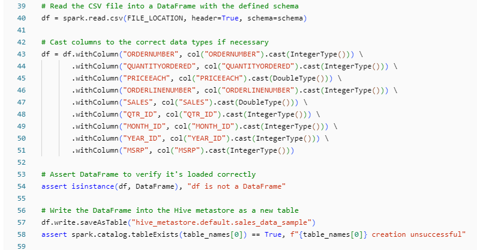
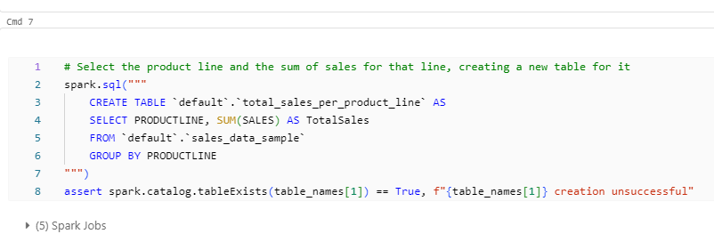
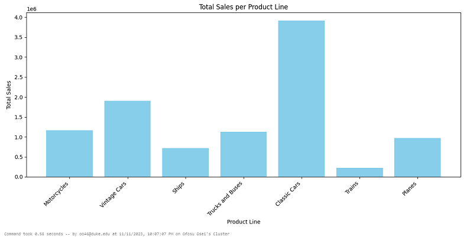
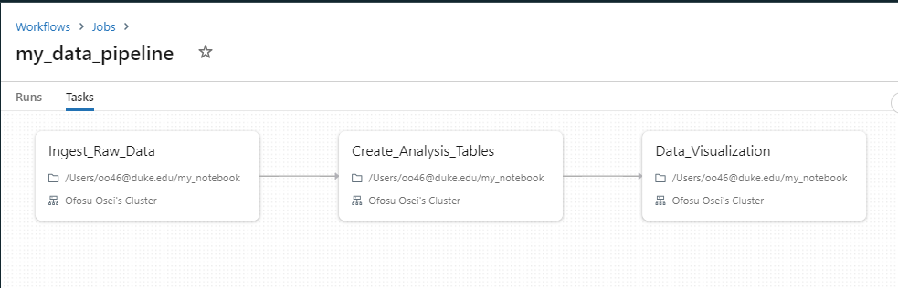
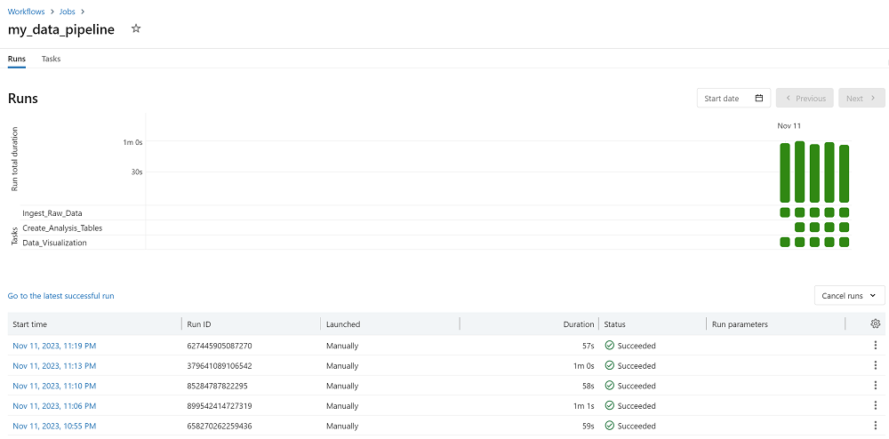

[][def]

# Mini Project Week 11

The current implementation of the mini project is a data pipeline using the Mocrosoft Azure Databricks platform.

## Mini Project Deliverables:

[A Data Pipeline Notebook](https://github.com/nogibjj/oo46_Mini_Proj_W11/blob/main/Data_Pipeline.ipynb) with cells that perform a series of data processing taks:

### Data Ingestion

### Creation of Analysis Tables

### Data Visualizations

### Data Pipeline Summary

### Job Run Analytics

[def]: https://https://github.com/nogibjj/oo46_Mini_Proj_W11/actions/workflows/actions.yml
